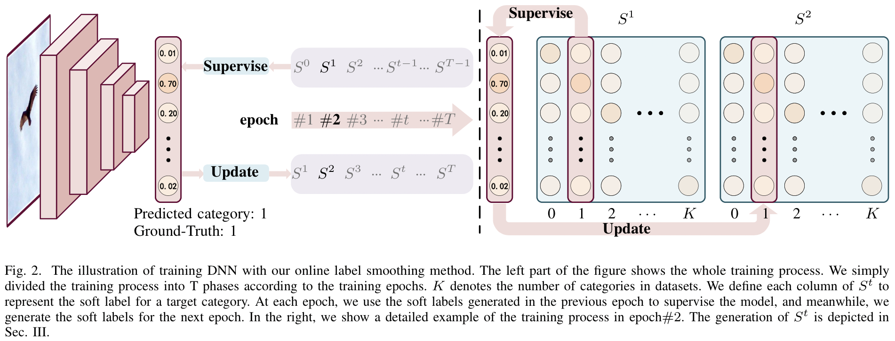
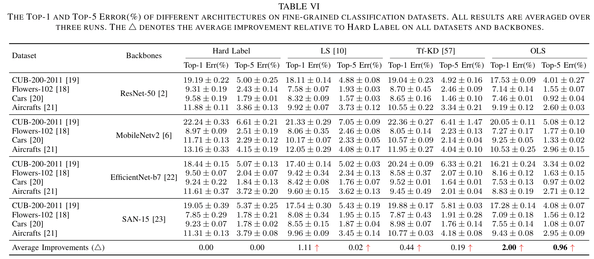

# Online Label Smoothing
The code for the paper ["Delving Deep into Label Smoothing"](https://arxiv.org/pdf/2011.12562.pdf)  
I have only cleaned the code on the fine-grained datasets.
Since I am not currently in school, I have not tested it.
So if there are any bugs, please feel easy to contact me (zhangchbin AATT gmail Ddot com).


# Performance
## Classification for fine-grained datasets


## Other


# TODO
- training scripts for more network and datasets
- EfficientNet for fine-grained classification
- SAN network for fine-grained classification
- training code on the ImageNet and CIFAR
- training code on the Noisy-CIFAR
- adversarial attack code on the ImageNet and CIFAR
- the download link of CUB-200-2011, Flowers, Cars and dogs

# Requirements
```
pytorch >= 1.0
torchvision
numpy
tensorboardX
apex
tqdm
efficientnet_pytorch
SAN_network
```
[efficientnet_pytorch](https://github.com/lukemelas/EfficientNet-PyTorch)  
[SAN network](https://github.com/hszhao/SAN)

# Data Preparation
I will updated the download link and the file directory of all datasets soon.

# train and validate
1. download the ImageNet pretrained model to ```checkpoint```
   [MobileNet-v2](https://download.pytorch.org/models/mobilenet_v2-b0353104.pth), [ResNet-50](https://download.pytorch.org/models/resnet50-19c8e357.pth), [Res2Net](https://shanghuagao.oss-cn-beijing.aliyuncs.com/res2net/res2net50_26w_8s-2c7c9f12.pth)
2. Download all data to the ```data``` dir
3. train the model with online label smoothing:  
    ```
    CUDA_VISIBLE_DEVICES=1 python main.py \
	--mode train \
	--pretrained_model ./checkpoint/mobilenet_v2-b0353104.pth \
	--epochs 100 \
	--lr 0.01 \
	--arch mobilenetv2 \
	--dataset cub \
	--method ols \
	--batch_size 64 \
    ```
  
    (optional) test the model ensemble performance:
    ```
    python main.py \
	--mode ensemble \
	--ensemble 'runs/mobilenetv2_cub_ols/20.pth' 'runs/mobilenetv2_cub_ols/60.pth' \
	--epochs 100 \
	--lr 0.01 \
	--arch mobilenetv2 \
	--dataset aircraft \
	--method ols \
	--batch_size 64 \
    ```

## Other realated implementation
Thanks to the re-implementation in [code](https://github.com/Kurumi233/OnlineLabelSmoothing)
