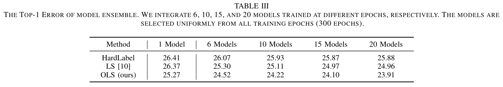

# Online Label Smoothing
The code for the paper ["Delving Deep into Label Smoothing"](https://arxiv.org/abs/2011.12562)  
I have only cleaned the code on the fine-grained datasets.
Since I am not currently in school, I have not tested it.
So if there are any bugs, please feel easy to contact me (zhangchbin AATT gmail Ddot com).


# Citation
```
@ARTICLE{zhang2021delving,
  author={Zhang, Chang-Bin and Jiang, Peng-Tao and Hou, Qibin and Wei, Yunchao and Han, Qi and Li, Zhen and Cheng, Ming-Ming},
  journal={IEEE Transactions on Image Processing}, 
  title={Delving Deep into Label Smoothing}, 
  year={2021},
  volume={30},
  number={},
  pages={5984-5996},
  doi={10.1109/TIP.2021.3089942}}
```

# Performance
## Classification for fine-grained datasets


## Model ensemble on CIFAR-100



# TODO
- supporting for Jittor
- training scripts for more network and datasets
- ~~EfficientNet for classification~~
- ~~SAN network for classification~~
- training code on the ImageNet
- training code on the Noisy-CIFAR
- adversarial attack code on the ImageNet and CIFAR
- ~~training code on the CIFAR~~
- ~~the download link of CUB-200-2011, Flowers, Cars and dogs~~

# Requirements
```
pytorch >= 1.0
torchvision
numpy
tensorboardX
apex
tqdm
efficientnet_pytorch
SAN_network
```
[efficientnet_pytorch](https://github.com/lukemelas/EfficientNet-PyTorch)  
[SAN network](https://github.com/hszhao/SAN)

# Data Preparation
Download all datasets to the ```data``` directory, note that we modify the division for datasets as shown in files in the ```data``` directory:

- You can download the images from [Cars](http://ai.stanford.edu/~jkrause/cars/car_dataset.html). And the lists for training and validation are in the ```data``` directory.
- You can download the images from [Aircrafts](https://www.robots.ox.ac.uk/~vgg/data/fgvc-aircraft/). And the lists are in the ```data``` directory.
- You can download the images from [Flowers](https://www.robots.ox.ac.uk/~vgg/data/flowers/) with 102 classes. And the lists are in the ```data``` directory.
- You can download the images from [Standford-dogs](http://vision.stanford.edu/aditya86/ImageNetDogs/). And the lists are in the ```data``` directory.

# Train and Validate
1. download the ImageNet pretrained model to ```checkpoint```  
   [MobileNet-v2](https://download.pytorch.org/models/mobilenet_v2-b0353104.pth), [ResNet-50](https://download.pytorch.org/models/resnet50-19c8e357.pth), [Res2Net](https://shanghuagao.oss-cn-beijing.aliyuncs.com/res2net/res2net50_26w_8s-2c7c9f12.pth)


2. train the model with online label smoothing:  
    ```
    CUDA_VISIBLE_DEVICES=1 python main.py \
	--mode train \
	--pretrained_model ./checkpoint/mobilenet_v2-b0353104.pth \
	--epochs 100 \
	--lr 0.01 \
	--arch mobilenetv2 \
	--dataset cub \
	--method ols \
	--batch_size 64 \
    ```
  
    (optional) test the model ensemble performance:
    ```
    python main.py \
	--mode ensemble \
	--ensemble 'runs/mobilenetv2_cub_ols/20.pth' 'runs/mobilenetv2_cub_ols/60.pth' \
	--epochs 100 \
	--lr 0.01 \
	--arch mobilenetv2 \
	--dataset aircraft \
	--method ols \
	--batch_size 64 \
    ```

# Train on CIFAR
    ```
    cd cifar
    sh train_cifar_imagenetresnet34.sh
    sh train_cifar_resnext29_2.sh
    ````

## Other realated implementation
Thanks to the re-implementation in [Kurumi233](https://github.com/Kurumi233/OnlineLabelSmoothing) and [ankandrew](https://github.com/ankandrew/online-label-smoothing-pt)
